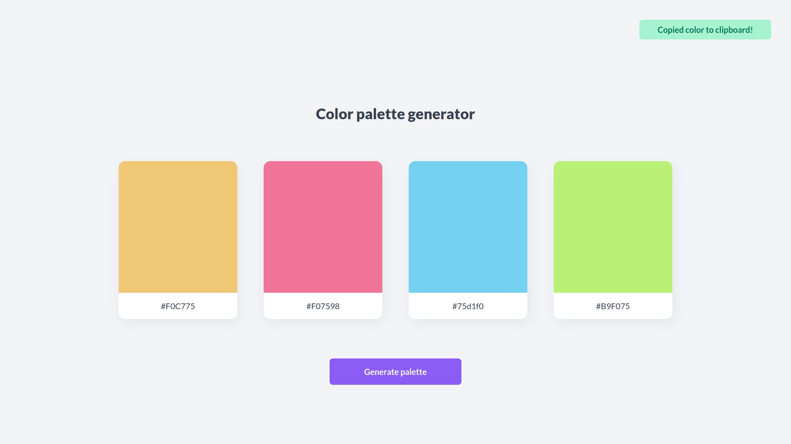

# Palette Generator

A website for generating color palettes, built with React and Tailwind CSS.
See it live [here](https://react-palette-gen.netlify.app). It supports:

-   Generating palettes of 4 colors.
-   Generating new palettes using either the spacebar or mouse.
-   Copying a color to the clipboard by clicking on it.



The palettes are generated using the HSL color space, with S (saturation) set
at 85% and L (light) set at 70%. This reduces the number of washed-out or dark
colors, but it might sometimes also make colors in the same palette seem
similar.

## Installation

First, clone this repo:

```bash
git clone https://github.com/thamika123/palette-generator.git
```

Next, install all the necessary dependencies:

```bash
npm install
```

Finally, run Parcel:

```bash
npm run serve
```

Open your browser and navigate to `localhost:1234`.
